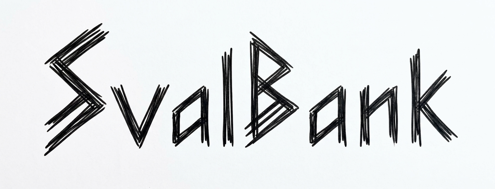

<p align="center">
  
</p>

# Svalbank

> **Disclaimer:** Svalbank is a personal project. It is not a real bank, does not hold or move real money, and does not constitute financial, banking, or investment services or advice of any kind.

## Architecture

**Java / Spring Boot — transactional core** (`java_bank/`)
- Owns accounts, a double-entry ledger, and transfers in PostgreSQL.
- Correctness over throughput: JPA, `@Transactional`, row-level locking.
- Rich domain model enforces invariants: non-negative balances, deterministic lock ordering on transfers.
- Idempotency keys on money-moving endpoints.
- Schema migrations with Liquibase.

**Outbox pattern — reliable events**
- No dual-write to Postgres and Kafka (it can't be atomic).
- Business change and an `outbox_event` row commit in the same local transaction.
- A relay polls unpublished rows and publishes `transaction.completed` to Kafka.

**Go — webhook dispatcher** (`fanout_go/`)
- Consumes `transaction.completed` events from Kafka.
- Fans out webhooks to thousands of merchant endpoints concurrently.
- Retries with exponential backoff.
- Idempotent: dedupes on event ID (Kafka is at-least-once).
- Reports delivery status back to the Java service over gRPC.

**Why two languages**
- Java: the ledger needs transactions and complex invariants.
- Go: high-fanout, near-stateless network I/O, where cheap goroutines win.

## Flow

```
Client ──HTTP──▶ Java service ──tx──▶ Postgres (ledger + outbox_event)
                                          │
                                   outbox relay
                                          ▼
                                 Kafka: transaction.completed
                                          │
                                          ▼
                                   Go dispatcher ──webhooks──▶ Merchants
                                          │
                                  gRPC delivery status ──▶ Java service
```

## Stack

Java 21 · Spring Boot 4 · PostgreSQL · Liquibase · Kafka · Redis · Go · gRPC · Docker Compose
